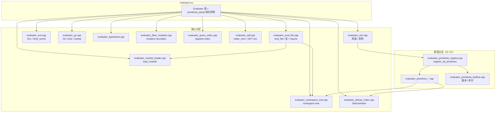

# 架构概览

代码为真相。本文是模块地图；完整模块表见 [generated/modules.md](generated/modules.md)。

## 数据流

```
源码 ──► parser ──► FlatAST (workspace)
              │
              ▼
         type_checker ──► 类型 / 约束
              │
              ▼
         lowering ──► IRModule
              │
      ┌───────┴───────┐
      ▼               ▼
 eval_flat       ir_executor / aura_jit
 (树遍历)         (解释 / LLVM ORC)
      │               │
      └───────┬───────┘
              ▼
         EvalValue 结果
```

Agent 自修改路径：`set-code` → `query:*` / `mutate:*` → `eval-current`（可走 JIT）。JSON 入口：`--serve-async`（见 [wire-formats.md](wire-formats.md)）。

并行 Agent 路径：`parallel-intend` / `orch:spawn-agent` → Scheduler fibers → `Fiber::join` + MultiFiberMailbox → 结果 hash（见 [orchestration-tutorial.md](orchestration-tutorial.md)）。

## C++ 模块（`export module`）

| 模块 | 路径 | 职责 |
|------|------|------|
| `aura.parser.*` | `src/parser/` | 词法、语法 → FlatAST |
| `aura.core.*` | `src/core/` | AST 节点、Arena、类型基础设施、ResourceQuota |
| `aura.compiler.evaluator` | `evaluator.ixx` + 44 分区 `.cpp` | 运行时中枢、原语、eval_flat（见下节） |
| `aura.compiler.query` | `query.*` | QueryEngine、DefUseIndex |
| `aura.compiler.type_checker` | `type_checker.*` | 渐进类型、Let-Poly、线性 |
| `aura.compiler.lowering` | `lowering.*` | AST → IR |
| `aura.compiler.ir` | `ir.ixx` | IR 指令、模块结构 |
| `aura.compiler.ir_executor` | `ir_executor.*` | IR 解释器 |
| `aura.compiler.service` | `service.ixx` | 编译服务、增量 cache、脏标记 |
| `aura.compiler.cache` | `cache.*` | EDSL V2 source-hash cache |
| JIT | `aura_jit.*` | LLVM ORC、hot-swap、prim bridge |
| Serve | `src/serve/` | fiber、scheduler、mailbox、parallel_orch、GC 协调 |
| Orch | `src/orch/` | unified agent_spawn / parallel_orch facade (#1588) |

## Evaluator 分区（`aura.compiler.evaluator`）

原 `evaluator_impl.cpp` 已拆为 **1 接口 + 44 实现 TU**，同属一个 C++26 module partition。接口在 `evaluator.ixx`；实现按职责分文件，原语经 `evaluator_primitives_registry.cpp` 编排（构造器内原语在 `evaluator_ctor.cpp`）。



| 层 | TU | 入口符号 |
|----|-----|----------|
| 求值 | `evaluator_eval_flat.cpp` | `eval_flat`、`apply_closure` |
| 环境 | `evaluator_env.cpp` | `Env::lookup*`、`bind_symid` |
| 自修改 | `evaluator_workspace_tree.cpp`、`evaluator_primitives_mutate.cpp` | `workspace_mtx_`、`mutate:*` |
| 查询 | `evaluator_primitives_query_*.cpp`、`evaluator_query_index.cpp` | `query:*`、`build_tag_arity_index` |
| 原语表 | `evaluator_primitives_registry.cpp` | `init_pair_primitives` → `register_all_primitives` |

完整文件列表见 [contributing.md §文件地图](contributing.md#文件地图)。

## 自修改 EDSL（C++ 原语）

在 `evaluator_primitives_registry.cpp` 及各 `evaluator_primitives_*.cpp` 分区经 `primitives_.add` 注册（约 400+ 个）。核心集群：

| 集群 | 示例 | 测试 |
|------|------|------|
| 加载/执行 | `set-code`, `eval-current` | `tests/suite/core.aura` |
| Query | `(query :find …)`, `query:pattern` | `tests/suite/edsl_errors.aura` · #1435 |
| Mutate | `(mutate :rebind …)`, `mutate:query-and-replace` | `tests/suite/mutate-structured.aura` · #1436 |
| 版本 | `ast:snapshot`, `ast:restore`, `rollback` | `tests/panic_rollback.aura` |
| Workspace | `(workspace :create|:merge|:lock …)` | `tests/suite/module.aura` · #1437 |

Aura 层 helper：`lib/std/query.aura`（3 个）、`lib/std/refactor.aura`、`lib/std/workspace.aura`。

## Agent 编排

分层（低 → 高）：

| 层 | 路径 | 职责 |
|----|------|------|
| Fiber runtime | `src/serve/fiber.h`, `scheduler.h` | M:N 调度、`Fiber::join` / `join(span)` (#1584) |
| Mailbox | `src/serve/multi_fiber_mailbox.h` | multi-attach、broadcast、背压 (#1585) |
| Parallel batch | `src/serve/parallel_orch.h` | `parallel_intend` 并发 cap / timeout / fail-fast (#1586) |
| Composition | **`src/orch/`** | `agent_spawn` + mailbox + join + `conduct_parallel` (#1588) |
| Aura primitives | `evaluator_primitives_agent.cpp` | `(parallel-intend)`、`orch:spawn-agent`、… (#1587/#1588) |
| Stdlib | `lib/std/orchestrator.aura` | 纯 Aura 角色 / pipeline / agent registry |

```
                    ┌─────────────────────────────┐
  Aura Agent code   │ parallel-intend / orch:*    │
                    └──────────────┬──────────────┘
                                   ▼
                    ┌─────────────────────────────┐
  src/orch/         │ agent_spawn · conduct_      │
  (composition)     │ parallel · join_agent       │
                    └──────────────┬──────────────┘
                                   ▼
        ┌──────────────────────────┼──────────────────────────┐
        ▼                          ▼                          ▼
  Scheduler/Fiber           MultiFiberMailbox           ResourceQuota
  (join / steal)            (backpressure)              (#1600)
        │                          │                          │
        └──────────────────────────┴──────────────────────────┘
                                   ▼
                    query:parallel-orch-stats · closedloop orch-health
```

**并行编排管线（典型）：**

1. 构造 N 个 0-arg thunk（或 C++ `TaskSpec`）
2. `parallel_intend(sched, tasks, ParallelPolicy{max_concurrency, timeout_ms, fail_fast})`
3. 内部：permit gate 限流 → `Scheduler::spawn` → 完成时可选 mailbox `push`
4. `Fiber::join(span, timeout)` 聚合 → `BatchResult` / Aura hash
5. 观测：`query:parallel-orch-stats`、`query:ai-closedloop-readiness-stats`（orch 字段）

**线程安全要点：**

- Aura `(parallel-intend)` 对 Evaluator 调用 **mutex 串行化**（闭包 body 不跨线程 eval）；并发收益来自 spawn/join/gate。
- 跨 fiber 共享 AST 节点须 `StableNodeRef`；mutation 须 `MutationBoundaryGuard`。
- Fiber 配额：`process_resource_quota` Fibers 维 → `BatchStatus::QuotaExceeded` / `AgentHandle.quota_exceeded` (#1600)。

**文档与测试：**

- 教程：[orchestration-tutorial.md](orchestration-tutorial.md)（#1603）
- 设计：`docs/design/parallel-orch.md` · `docs/design/src-orch-module.md` · `src/orch/README.md`
- 协议字段：[wire-formats.md §10](wire-formats.md#10-parallel-orchestration-contracts-1584--1600)
- 测试：`tests/suite/orchestrator.aura` · `tests/suite/concurrent.aura` · `tests/suite/parallel_orchestration_stress.aura` (#1602) · `tests/test_parallel_orch.cpp` · `tests/test_orch_agent_spawn.cpp`
- 跨 eval/mutate 持有节点：`docs/design/core/stable_ref_best_practices.md`

## 标准库

`lib/std/*.aura` — 每个文件 `(export …)` + 文件头注释即 API。加载：`(require "std/list" all:)`。

## Primitive vs Stdlib 边界

Primitive 是 C++ `evaluator_primitives_*.cpp` 里注册到 `Primitives` 表的 entry，runtime 在 `eval_flat` / IR / JIT 里直接调用。Stdlib 是 `lib/std/*.aura` 里 `(export …)` 的 Aura 函数，runtime 通过 `eval` + `apply` 路径调用。

**默认下沉决策：stdlib。** 只有满足 [决策框架](design/primitive-vs-stdlib-decision-framework.md) 的 7 条红线 (engine-boot / 内部状态访问 / 性能热路径 / FFI / 类型系统 / 观测性 / 诊断恢复) 才下沉为 primitive。绝大多数用户级 API 都应该是 stdlib。

**表面收敛（进行中）：** 对外稳定面尽量小，观测折叠为 metrics facade，其余宏/stdlib；见 [design/primitives-surface-refactor.md](design/primitives-surface-refactor.md)（分阶段 + CI 分层）。

注册点（与注册函数）：

| 簇 / 前缀 | 源文件 | 注册函数 |
|-----------|--------|----------|
| 类型谓词 / `not` | `evaluator_primitives_core.cpp` | `register_type_and_char_primitives` |
| pair / string | `evaluator_primitives_pair.cpp` | `register_pair_and_string_primitives` |
| list / apply | `evaluator_primitives_list.cpp` | `register_list_primitives` |
| JSON | `evaluator_primitives_json.cpp` | `register_json_primitives` |
| vector / hash | `evaluator_primitives_vector.cpp` | `register_vector_and_hash_primitives` |
| math / regex | `evaluator_primitives_math.cpp` | `register_math_regex_and_arithmetic_primitives` |
| reflect / keyword | `evaluator_primitives_reflect.cpp` | `register_reflect_and_type_primitives` |
| `query:module-*` | `evaluator_primitives_query.cpp` | `register_query_primitives` |
| `query:*` workspace | `evaluator_primitives_query_workspace.cpp` | `register_workspace_query_primitives` |
| `query:*` def-use | `evaluator_primitives_query_defuse.cpp` | `register_defuse_query_primitives` |
| `mutate:*` | `evaluator_primitives_mutate.cpp` | `register_mutate_primitives` |
| `workspace:*` | `evaluator_primitives_workspace.cpp` | `register_workspace_primitives` |
| `ast:*` | `evaluator_primitives_ast.cpp` | `register_ast_primitives` |
| `compile:*` / JIT 观测 | `evaluator_primitives_compile.cpp` / `observability.cpp` | 各 `register_*` |
| messaging / fiber | `evaluator_primitives_messaging.cpp` | `register_messaging_primitives` |
| git / network | `evaluator_primitives_io.cpp` | `register_git/network_primitives` |
| agent / synthesize | `evaluator_primitives_agent.cpp` | `register_auto_evolve/synthesize/strategy` |

完整列表 `docs/generated/primitives.md`（`./build.py docs` 生成）。修改后必须 regenerate + commit，否则 `./build.py gate` 挂。

## 贡献运行时

读 [contributing.md](contributing.md)（FlatAST 不变式、锁、defuse）。历史设计文档在 `git tag docs-archive-pre-2026-06`。

## Error handling policy (Issues #807 / #809)

Hot paths use `AuraResult` / `EvalResult`; exceptions only for OOM, init failures, and hard invariants. See [`design/error-handling-policy.md`](design/error-handling-policy.md).
